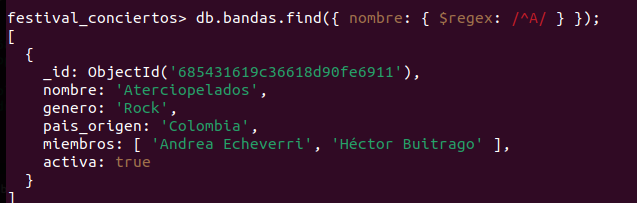
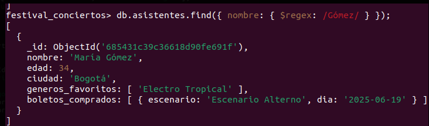
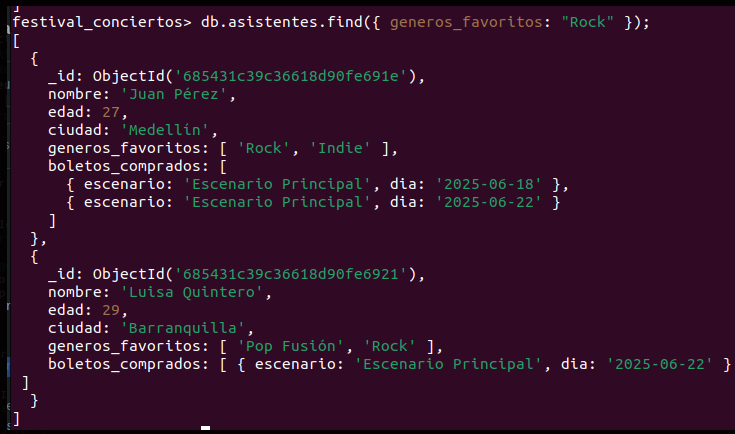
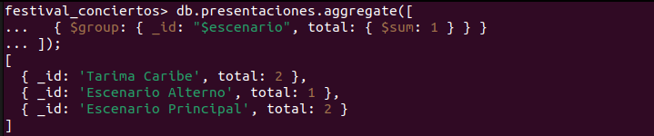
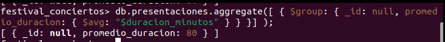

# festival_colombia

# 🎸 Festival de Conciertos en Colombia

## 🧑‍💻 Integrantes  
- Karina Argenis Sanabria Casas
- Manuel Santiago Larrotta Meneses

---

## 🗂️ Descripción del Proyecto  
Este proyecto implementa una base de datos en MongoDB para simular un festival de conciertos en Colombia.  
Se incluyen consultas, funciones personalizadas, transacciones e índices, demostrando el manejo de operaciones avanzadas en MongoDB.

---

## 📋 Requerimientos cumplidos

### 🔍 Consultas  
- ✅ Bandas que empiezan por `"A"` (expresión regular)  
- ✅ Asistentes con apellido `"Gómez"`  
- ✅ Asistentes que escuchan `"Rock"`  
- ✅ Conteo de presentaciones por escenario  
- ✅ Promedio de duración de presentaciones  

### 📦 Funciones (`system.js`)  
- ✅ `escenariosPorCiudad(ciudad)`  
- ✅ `bandasPorGenero(genero)`

### 🔁 Transacciones  
- ✅ Compra de boleto (update asistente + resta capacidad)  
- ✅ Reverso de compra (delete boleto + suma capacidad)

### ⚙️ Índices  
- ✅ Índice en `bandas.nombre` y búsqueda exacta  
- ✅ Índice en `presentaciones.escenario` y conteo  
- ✅ Índice compuesto en `asistentes.ciudad` y `edad`, consulta menores de 30

---
### 1. Consultas
## 🧪 Evidencias
-  Bandas que empiezan por `"A"` (expresión regular)
# EVIDENCIA

-  Asistentes con apellido `"Gómez"`  

- Asistentes que escuchan `"Rock"`
- 

- Asistentes que escuchan `"Rock"`
  - 

- Promedio de duración de presentaciones  
-  

